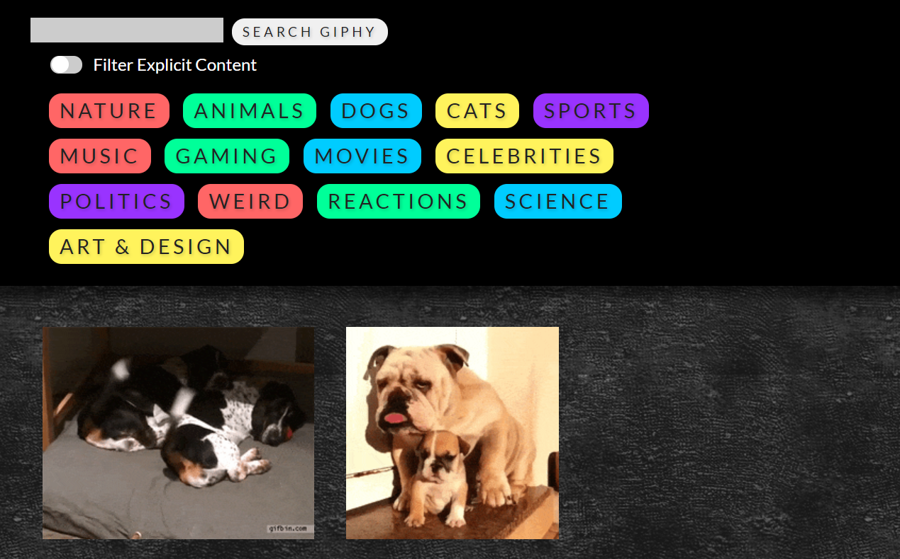

# GIPHY API

### Description

- A GIPHY API with a dynamic web page that populates with gifs of your choice. The GIPHY API uses JavaScript and jQuery to change the HTML of the site.
- _**[Click here](https://xtrachase.github.io/giphy-api/)**_ to visit the deployed site

## What I Learned

- How to use an API by goin through JSON data that is returned by a call.
- How to organize that data and write it to a website dynamically

### Technologies

- HTML
- CSS
- Javascript
- Giphy API

